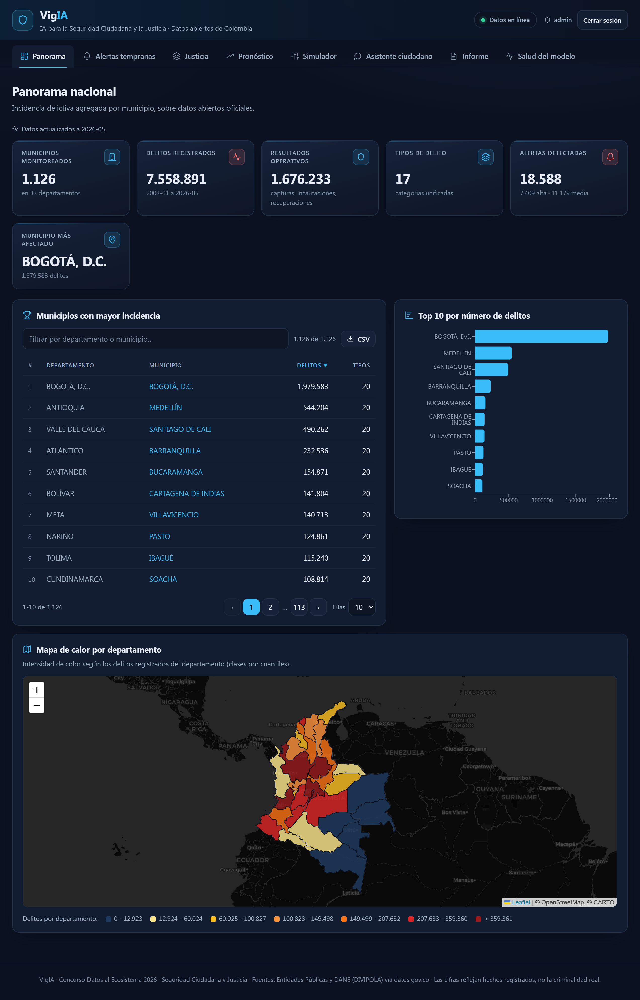
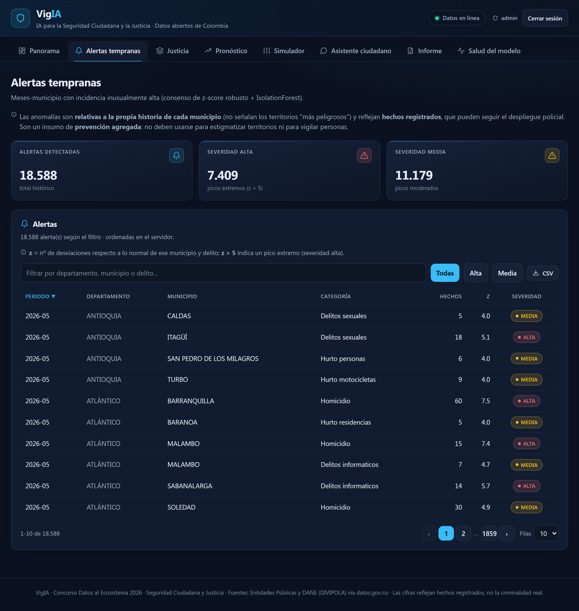
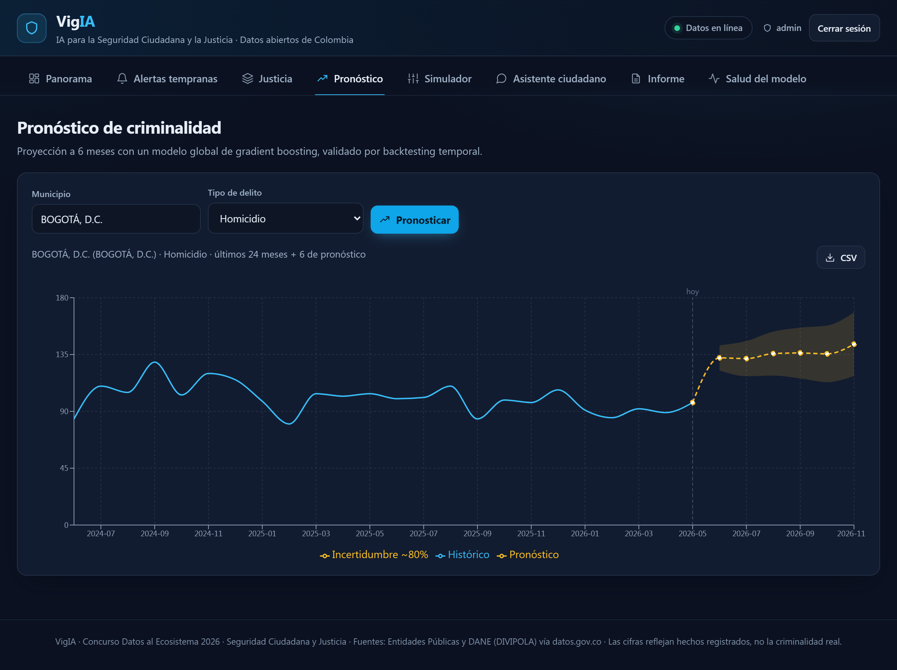
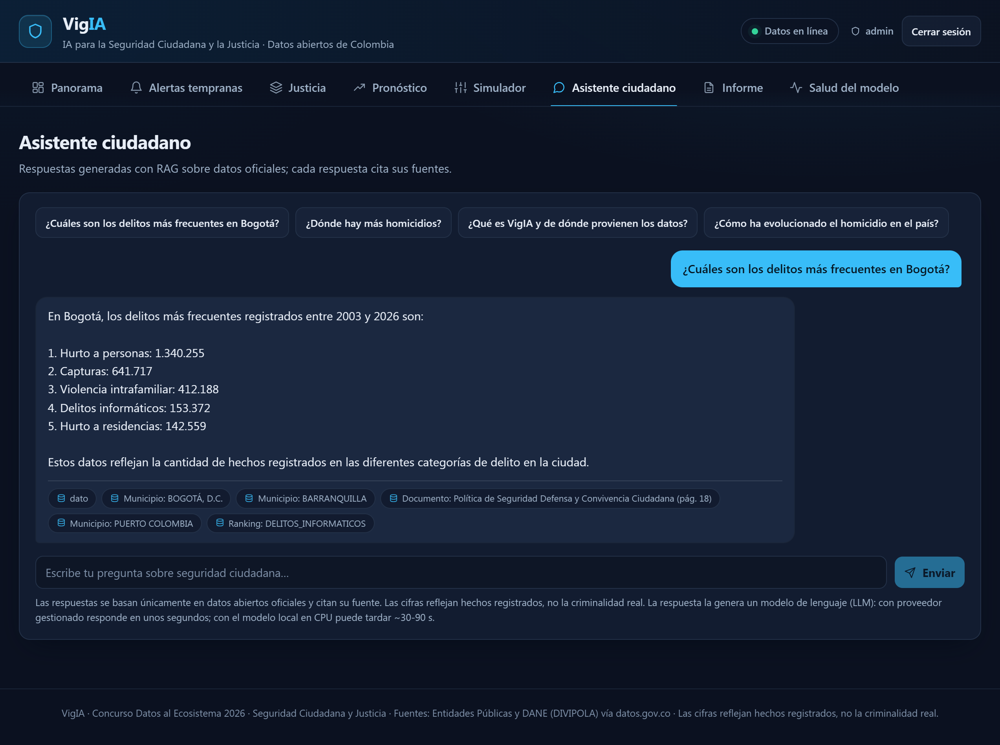
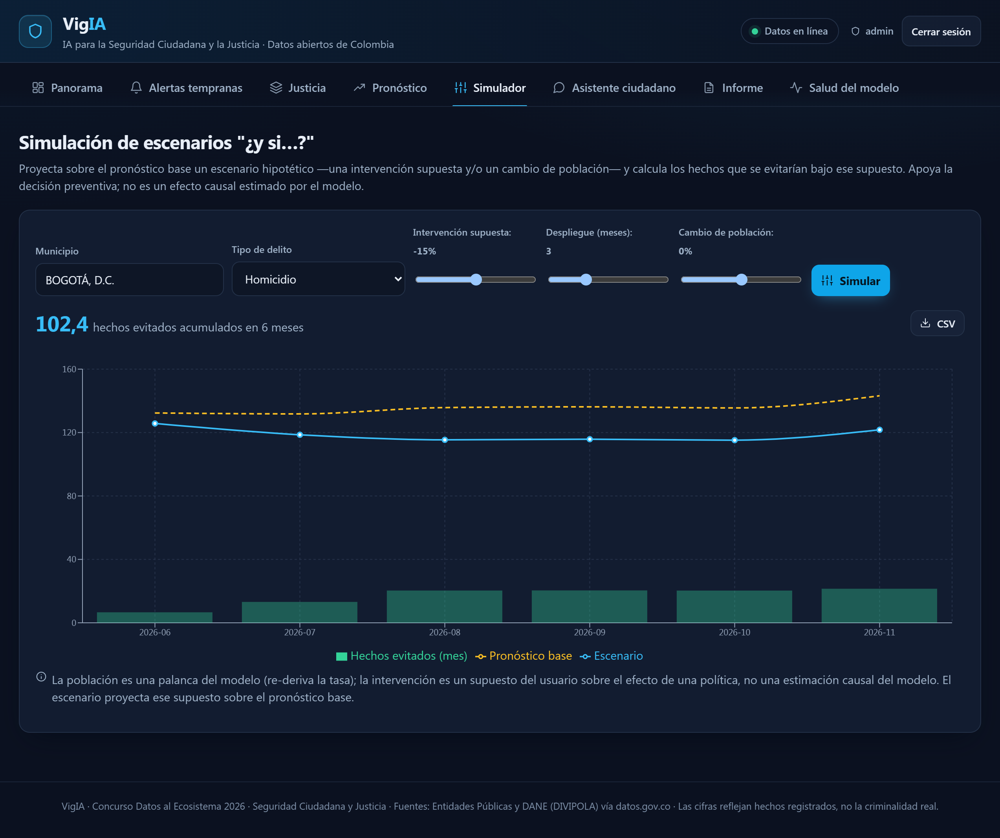
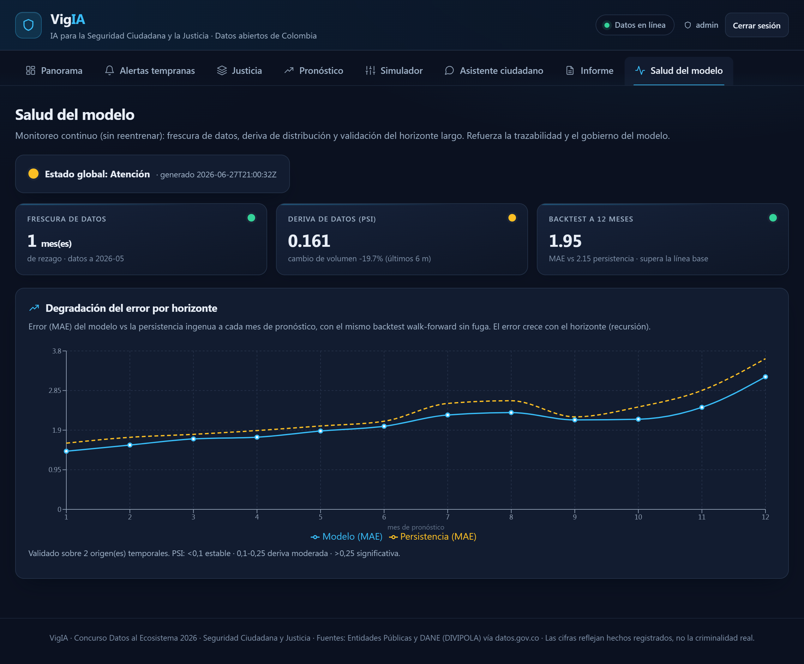
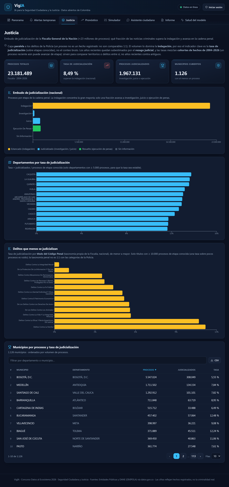
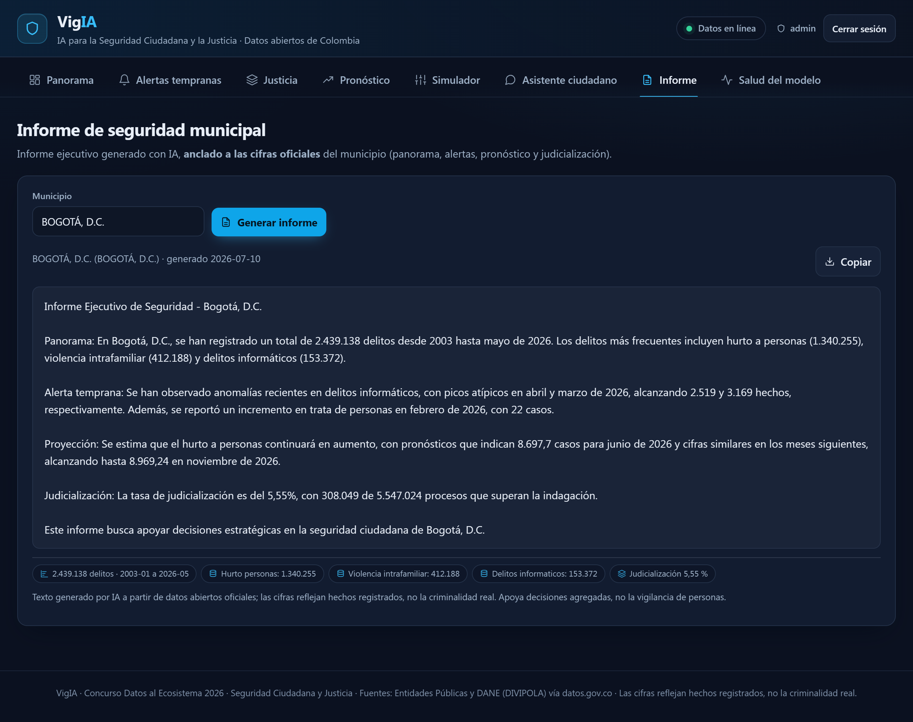
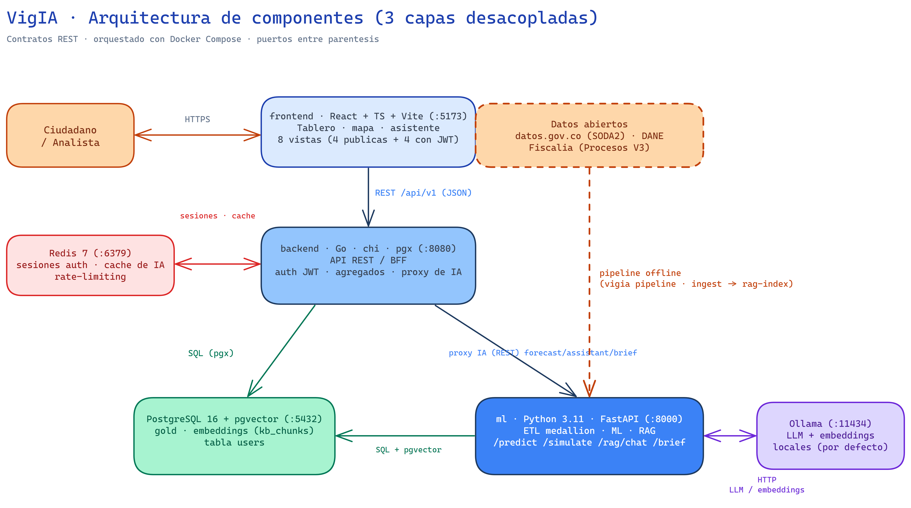

# VigIA 🛡️ — Inteligencia Artificial para la Seguridad Ciudadana y la Justicia

[](https://github.com/diegoa-rodriguezc/vigia/actions/workflows/ci.yml)

> **Concurso Datos al Ecosistema 2026 — IA para Colombia** <br/>
> **Reto:** Seguridad Ciudadana y Justicia <br/>
> **Nivel:** Avanzado

**VigIA** (de *vigía* + *IA*) es una plataforma de analítica predictiva y asistencia ciudadana que
transforma los datos abiertos de criminalidad de Colombia en **alertas tempranas, pronósticos y
conocimiento accionable** para fortalecer las políticas públicas de seguridad y justicia.

---

**Tabla de contenido**

- [Problema y propuesta de valor](#-problema-y-propuesta-de-valor)
- [El tablero en imágenes](#️-el-tablero-en-imágenes)
- [Arquitectura](#-arquitectura)
- [Estructura del repositorio](#️-estructura-del-repositorio)
- [Instalación](#-instalación)
    - [Ejecución en CPU](#ejecución-en-cpu)
    - [Aceleración por GPU (opcional)](#aceleración-por-gpu-opcional)
- [Acceso a la aplicación](#-acceso-a-la-aplicación)
    - [Inicio de sesión (funciones de IA)](#inicio-de-sesión-funciones-de-ia)
    - [Navegación por el tablero](#navegación-por-el-tablero)
- [Metodología](#-metodología)
- [Datos abiertos utilizados](#-datos-abiertos-utilizados)
- [Alineación con las Hojas de Ruta de Datos Abiertos Estratégicos](#️-alineación-con-las-hojas-de-ruta-de-datos-abiertos-estratégicos)
- [Impacto, escalabilidad y enfoque territorial](#-impacto-escalabilidad-y-enfoque-territorial)
- [Equipo](#-equipo)
- [Seguridad y acceso](#-seguridad-y-acceso)
- [Ética y reproducibilidad](#️-ética-y-reproducibilidad)
- [Licencia](#-licencia)

## 🎯 Problema y propuesta de valor

Las entidades territoriales y la ciudadanía carecen de herramientas que conviertan el enorme volumen
de datos delictivos publicados por las entidades públicas en **decisiones preventivas**. VigIA responde con:

| Componente IA | Qué hace | Reto del concurso |
|---|---|---|
| 🔮 **Pronóstico de criminalidad** | Predice la incidencia de delitos **por municipio y mes**, con banda de incertidumbre | Analítica predictiva |
| 🎛️ **Simulación de escenarios "¿y si…?"** | Proyecta el efecto de una intervención o un cambio de población sobre el pronóstico y estima **hechos evitados** | Analítica prescriptiva |
| 🚨 **Detección de anomalías** | Identifica picos atípicos de criminalidad relativos a cada territorio (alerta temprana) | Detección de anomalías |
| 💬 **Asistente ciudadano (agente con herramientas)** | Responde en lenguaje natural usando solo datos oficiales; el LLM **elige y encadena herramientas** (pronóstico, anomalías, embudo de Justicia, serie histórica, base de conocimiento) y cita cada cifra | IA generativa + agente de IA |
| 📝 **Informe de seguridad municipal** | Genera un **informe ejecutivo** por municipio (panorama, alertas, pronóstico, judicialización) **anclado a las cifras oficiales** (`vigia brief` / `GET /brief`) | IA generativa (reportes automatizados) |
| 🩺 **Salud del modelo (monitoreo)** | Vigila **frescura** de datos, **deriva (PSI - Population Stability Index)** y validación a **12 meses** con semáforo, sin reentrenar | Calidad y gobierno del modelo |
| ⚖️ **Embudo de judicialización (Fiscalía)** | Mide qué fracción de las noticias criminales avanza en la cadena penal (tasa de judicialización por municipio) | Eje de **Justicia** |
| 📊 **Tablero interactivo** | Mapas, series y rankings por territorio | Visualización |

## 🖼️ El tablero en imágenes

> El tablero cuenta con ocho pestañas. **Pronóstico**, **Simulador**, **Asistente** e **Informe** requieren
> inicio de sesión (cómputo de IA protegido); **Panorama**, **Alertas**, **Justicia** y **Salud del modelo**
> son públicas.

A continuación se presentan las capturas de pantalla de la aplicación:

| Panorama | Alertas tempranas |
|---|---|
| [](docs/screenshots/01-panorama.png) | [](docs/screenshots/02-alertas.png) |
| KPIs nacionales, ranking de los 10 municipios de mayor incidencia, **mapa coroplético** por departamento y panel de **señales de prensa** recientes. | Tabla de **anomalías** por severidad, búsqueda/filtros y la explicación del z-robusto. |

| Pronóstico | Asistente ciudadano |
|---|---|
| [](docs/screenshots/03-pronostico.png) | [](docs/screenshots/04-asistente.png) |
| Selección municipio × categoría con **historia + pronóstico + banda de incertidumbre** (80 % nominal, **calibrada empíricamente sobre los residuos de la propia validación retrospectiva** (*backtest*) — cobertura 80 % por construcción, ver [CRISP-ML(Q)](docs/CRISP-ML-Q.md#4-evaluación-del-modelo)). | Responde **solo con datos oficiales** y **cita cada cifra** (fichas de fuente). En el modo por defecto (**Ollama local**) usa **RAG clásico** —la captura—; con un proveedor con uso de herramientas (*tool-use*: **Anthropic/OpenAI**) opera como **agente que elige y encadena herramientas** (pronóstico, anomalías, embudo de Justicia…). |

| Simulador | Salud del modelo |
|---|---|
| [](docs/screenshots/05-simulador.png) | [](docs/screenshots/06-salud.png) |
| Palancas de intervención/población con **base vs escenario** y el KPI de **hechos evitados** (supuesto del usuario, no efecto causal estimado por el modelo). | **Semáforo** de frescura, **deriva (PSI - Population Stability Index)** y validación retrospectiva (*backtest*) a 12 meses con la degradación del error por horizonte. |

| Justicia | Informe (IA generativa) |
|---|---|
| [](docs/screenshots/07-justicia.png) | [](docs/screenshots/08-informe.png) |
| **Embudo de judicialización** de la Fiscalía (capa paralela): tasa nacional **8,51 %**, KPIs, barras por departamento y tabla por municipio. | **Informe ejecutivo municipal** generado por IA, **anclado a las cifras oficiales** (panorama, alertas, pronóstico, judicialización) con **fichas auditables**. |

**Qué ofrece cada pestaña:**

1. *Panorama* — los territorios y delitos de mayor incidencia en mapa y ranking; al hacer clic en un departamento, sus **señales de prensa recientes** en el panel de la derecha.
2. *Alertas tempranas* — los municipios con repuntes atípicos recientes (no solo volumen alto).
3. *Justicia* — el embudo de judicialización de la Fiscalía y la tasa por municipio/departamento.
4. *Pronóstico* — la proyección de un delito en un municipio a varios meses, con su banda de incertidumbre.
5. *Simulador* — palancas de intervención o de cambio de población, con los hechos que se evitarían frente al pronóstico base.
6. *Asistente* — preguntas en lenguaje natural ("¿cuál fue el delito más frecuente en Cali?", "¿cómo se proyectan los hurtos en Medellín?") respondidas con su fuente.
7. *Informe* — un informe ejecutivo del municipio (panorama, alertas, pronóstico y judicialización), también accesible desde el botón **Generar informe** del desglose por municipio del Panorama.
8. *Salud del modelo* — el semáforo de frescura, la deriva (PSI - Population Stability Index) y la validación del pronóstico a 12 meses.

> Para un **recorrido guiado paso a paso** tras el despliegue, ver
> [Navegación por el tablero](#navegación-por-el-tablero).

## 🧱 Arquitectura



> Diagrama editable: [`docs/diagrams/arquitectura.excalidraw`](docs/diagrams/arquitectura.excalidraw) (abrirlo en [excalidraw.com](https://excalidraw.com)).

Detalle completo en [docs/ARCHITECTURE.md](docs/ARCHITECTURE.md).

## 🗂️ Estructura del repositorio

```
vigia/
├── data/                  # Medallion bronze/silver/gold (no versionado) + kb_docs del RAG (versionado)
├── docs/                  # Documentación general (arquitectura, CRISP-ML(Q), diccionario, etc.)
├── notebooks/             # Exploración y perfilado (EDA) de las fuentes
├── ml/                    # Python: ETL + Machine Learning + RAG + API (FastAPI)
├── backend/               # Go: API REST / BFF
├── frontend/              # React + TypeScript: tablero y asistente
├── db/                    # Esquema SQL e inicialización (PostgreSQL + pgvector)
├── docker-compose.yml     # Orquestación de todos los servicios
└── Makefile               # Atajos del ciclo de vida del proyecto
```

> [!IMPORTANT]
> El presente proyecto tiene una implementación de un RAG (Retrieval-Augmented Generation), por lo cual
> si su equipo tiene tarjeta gráfica NVIDIA, se recomienda realizar los pasos mencionados en la sección
> [Aceleración por GPU](#aceleración-por-gpu-opcional) para su despliegue; de lo contrario, realice
> la [Ejecución en CPU](#ejecución-en-cpu), lo cual influye en el tiempo de despliegue del proyecto.

## 🚀 Instalación

> [!WARNING]
> **Requisitos:**
> - *Sistema operativo:* Windows 10/11, macOS 10.15 o superior, Linux (distribución a su elección).
> - *Hardware:* se recomiendan **16 GB de RAM** (los límites de memoria de los servicios suman ~13 GB y los
>   modelos de Ollama necesitan quedar residentes) y **~20 GB de disco libre** (imágenes de Docker, modelos
>   del LLM y lago de datos). Con 8 GB el despliegue completo puede fallar o degradarse notablemente.
> - Tener instalado [Docker](https://www.docker.com/products/docker-desktop/)
> - Tener instalado [Git](https://git-scm.com/) ([GitHub Desktop](https://github.com/apps/desktop) es opcional)
> - Tener instalado Make
>    - En **Windows** se instala mediante una terminal/PowerShell ejecutando el siguiente comando
>    ```powershell
>    winget install ezwinports.make
>    ```
>    - En **Linux** se instala mediante una terminal ejecutando el siguiente comando
>    ```bash
>    # comando para distribuciones Debian/Ubuntu, ajustar según el manejador de paquetes de su distribución
>    sudo apt-get install build-essential -y
>    ```

### Ejecución en CPU

En una ventana de comandos (cmd/terminal), ejecute los comandos que se describen a continuación:

1. Clone el repositorio (donde se ejecute el comando es donde se va a almacenar el código)
```bash
git clone https://github.com/diegoa-rodriguezc/vigia.git
```

2. Ingrese a la carpeta del proyecto previamente clonado (`vigia`)
```bash
cd vigia
```

3. Realice la copia del archivo `.env.example` y **edite** los valores del archivo `.env` según corresponda
```bash
cp .env.example .env          # ajustar las credenciales según corresponda al entorno (desarrollo/producción)
```

4. Para levantar los servicios se debe tener **Docker** instalado y en ejecución, y **Make** instalado (ver requisitos)
```bash
make deploy                   # up + descarga de modelos + pipeline con datos (todo en Docker)
```

Con el anterior comando, se levantan los contenedores de Docker con las imágenes necesarias para el despliegue del proyecto. *Este proceso puede tardar alrededor de 1 hora, debido a la descarga de las fuentes de datos, así como a la indexación de la base de conocimiento del RAG en CPU.*

> [!TIP]
> Para conocer más comandos ejecute `make help`, que lista todos los atajos disponibles con su descripción.

### Aceleración por GPU (opcional)

> [!NOTE]
> Requisitos: driver NVIDIA + **NVIDIA Container Toolkit** (Linux) o **Docker Desktop con backend WSL2**
> y driver NVIDIA con soporte WSL (Windows).

En una ventana de comandos (cmd/terminal), ejecute los comandos que se describen a continuación:

1. Clone el repositorio (donde se ejecute el comando es donde se va a almacenar el código)
```bash
git clone https://github.com/diegoa-rodriguezc/vigia.git
```

2. Ingrese a la carpeta del proyecto previamente clonado (`vigia`)
```bash
cd vigia
```

3. Realice la copia del archivo `.env.example` y **edite** los valores del archivo `.env` según corresponda
```bash
# ajustar las credenciales según corresponda al entorno (desarrollo/producción)
cp .env.example .env
```

4. Ejecute el comando para despliegue en GPU
```bash
# ejecución en GPU
make deploy-gpu
```

Con el anterior comando, se levantan los contenedores de Docker con las imágenes necesarias para el despliegue del proyecto. *Este proceso puede tardar alrededor de 30 minutos, debido a la descarga de las fuentes de datos y a la indexación de la base de conocimiento del RAG.*

## 🌐 Acceso a la aplicación

Una vez levantado/desplegado el proyecto, se puede acceder desde un navegador en la URL `http://localhost:5173`.

### Inicio de sesión (funciones de IA)

Las pestañas **Pronóstico**, **Simulador**, **Asistente** e **Informe** requieren iniciar sesión (protegen
el cómputo de IA); las otras cuatro son públicas. Dos caminos:

- **Crear una cuenta ciudadana:** botón **Crear cuenta** en la ventana de inicio de sesión (habilitado por
  defecto, `REGISTRATION_ENABLED=true`). La cuenta con rol `citizen` da acceso a todas las funciones de IA.
- **Cuenta administradora de demostración:** las credenciales definidas en su `.env`
  (`ADMIN_USERNAME`/`ADMIN_PASSWORD`; los valores del `.env.example` son `admin` / `Demo.VigIA.2026`).
  Son valores **de demostración pública**: en producción (`APP_ENV=production`) el backend **aborta el
  arranque** si siguen sin cambiarse.

> [!NOTE]
> **Latencia esperable en CPU:** el **Asistente** y el **Informe** invocan el LLM local y tardan **~30-90 s
> por respuesta** (hasta ~2 min en frío); las consultas repetidas se sirven de la caché en milisegundos
> (cabecera `X-Cache: HIT`). El **Pronóstico** y el **Simulador** responden en segundos (no invocan el LLM).
> Con GPU ([despliegue GPU](#aceleración-por-gpu-opcional)) o con un proveedor gestionado
> (`LLM_PROVIDER=anthropic|openai` en `.env`) la respuesta del asistente baja a segundos.

### Navegación por el tablero

1. **Panorama** (público) — observe los KPI nacionales y el mapa; **haga clic en un departamento** para ver
   sus señales de prensa recientes en el panel derecho, y en un municipio del ranking para su desglose.
2. **Alertas** (público) — repuntes atípicos *relativos a cada territorio*, con su severidad y su valor z.
3. **Justicia** (público) — embudo de judicialización de la Fiscalía (tasa nacional **8,51 %**).
4. **Inicie sesión** (sección anterior) y abra **Pronóstico** — p. ej. *Medellín × Homicidio*: historia,
   proyección a 6 meses y banda de incertidumbre.
5. **Simulador** — mueva la palanca de intervención y observe los **hechos evitados** frente al pronóstico base.
6. **Asistente** — pregunte, p. ej., *"¿cómo se proyectan los hurtos en Medellín?"* (en CPU tarda ~30-90 s;
   la respuesta cita sus fuentes).
7. **Salud del modelo** (público) — semáforo de frescura, deriva (PSI) y validación a 12 meses.

## 📐 Metodología

El proyecto sigue la metodología **CRISP-ML(Q)** (*Cross-Industry Standard Process for Machine Learning with
Quality Assurance*). Cada fase, sus controles de calidad y riesgos están documentados en
[docs/CRISP-ML-Q.md](docs/CRISP-ML-Q.md).

**Cómo se evalúa el modelo.** El pronóstico se valida con una **validación retrospectiva de origen
rodante** (*backtesting walk-forward* recursivo, sin fuga de información) contra **dos líneas base ingenuas**: la **persistencia** (repetir el último mes) y la
**estacional** (mismo mes del año anterior). La métrica de cabecera es el **MASE** (error escalado, estándar
para series de conteo) —**no** el sMAPE, que en hechos casi nulos (0/1) se dispara a >100 % por artefacto
aritmético, no por error real—. El modelo **supera a ambas líneas base en MAE**, a 1 paso y en el horizonte
completo que se sirve (6 meses), y a la persistencia **también en MASE** (el reporte no publica el MASE de la
estacional). Los márgenes, declarados con honestidad: frente a la **persistencia** la ventaja a 1 paso es
**modesta (+2,7 %)** y **se ensancha al proyectar** (+14 % en MAE multipaso, con ventaja creciente por paso);
frente a la **estacional** es de ≈+10 % en MAE (1 paso y multipaso), aunque no en todos los pasos (a 2 meses
la estacional queda ligeramente por delante) y en **sMAPE multipaso ambas quedan en empate práctico**
(113,5 vs 113,5). Cede en el sMAPE a 1 paso (el citado artefacto). Su valor se concentra en las series de **volumen medio y alto**
—donde hay señal recurrente y la planeación preventiva importa—; en las ultra-dispersas el naive es casi
óptimo por construcción y no se sobre-afirma nada. Las cifras reproducibles están en
[reports/model_report.json](reports/model_report.json).

## 🔓 Datos abiertos utilizados

**20 conjuntos de datos abiertos** de [datos.gov.co](https://www.datos.gov.co/browse?category=Seguridad+y+Defensa)
consumidos vía **API SODA2**. Su composición:

- **16 de eventos de la Policía** (catálogo *Seguridad y Defensa*) que conforman la serie unificada: **13 de
  delito** y **3 de respuesta institucional** (capturas, incautaciones y recuperaciones, separadas en la capa
  gold para no confundirlas con la incidencia ni dispararlas como alertas).
- **2 administrativos** (auditorías y demandas), que alimentan el asistente como contexto de transparencia.
- **1 de referencia oficial** — **DIVIPOLA** del DANE, para nombres y coordenadas.
- **1 de la Fiscalía General de la Nación** (*otra entidad*), que añade el eje de **Justicia** (abajo).

Los 20 se **alojan en datos.gov.co** —incluidos DIVIPOLA y *Procesos Fiscalía*, producidos por otras
entidades pero publicados allí—. La **población municipal del DANE** (sección más abajo) es una referencia
demográfica **adicional** que **no entra** en este conteo de 20. Las 16 fuentes de eventos se seleccionaron
del *Asset Inventory* oficial de la categoría (`uzcf-b9dh`, ~169 datasets **consultados**) por relevancia,
esquema y no duplicación. Inventario, selección y descartes justificados en
[docs/DATA_DICTIONARY.md](docs/DATA_DICTIONARY.md) y [docs/DATASETS.md](docs/DATASETS.md). La
**alineación con la Hoja de Ruta Nacional de Datos Abiertos Estratégicos** se detalla en la sección
siguiente.

**Eje de Justicia — Fiscalía General de la Nación.** Para no depender de una sola entidad (la Policía) y
cubrir la mitad de *"Justicia"* del reto, VigIA incorpora el dataset *Procesos Fiscalía V3* (`dbdv-iihs`,
~23 M de procesos) como **capa paralela**: aporta la sección **judicialización** (Indagación → Investigación
→ Juicio → Ejecución de Penas), una señal que ningún conteo de delitos tiene. Hallazgo nacional real: **solo
~8,5 % de las noticias criminales superan la indagación** (Bogotá, 5,6 %). No se fusiona con la serie de la
Policía (*proceso* ≠ *hecho registrado* → sería doble conteo). Como su API de agregación no es viable a ese
volumen, se ingiere por **paginación continua por clave (*streaming keyset*) + agregación local**
(reproducible sin token). Detalle, cifras y
*Advertencias de uso* en [docs/DATA_DICTIONARY.md](docs/DATA_DICTIONARY.md#capa-justicia--fiscalía-general-de-la-nación-fuente-de-otra-entidad-capa-paralela).

**Contexto demográfico — población municipal (DANE).** Para medir la criminalidad como **tasa por 100.000
habitantes** (comparable entre territorios) y enriquecer el pronóstico con una señal **exógena** (no solo
autorregresiva), se incorpora la **proyección/retroproyección de población municipal por área del DANE**
(2005-2035, nacional). datos.gov.co **no** publica esta serie nacional municipal —solo cargas sueltas por
municipio—, así que se usa el archivo oficial de [`dane.gov.co`](https://www.dane.gov.co/index.php/estadisticas-por-tema/demografia-y-poblacion/proyecciones-de-poblacion),
dato abierto de entidad pública admitido por el concurso. Detalle en
[docs/DATA_DICTIONARY.md](docs/DATA_DICTIONARY.md#población-municipal--denominador-para-tasas-por-100k-dane).

**Datos estructurados + no estructurados.** Además de las series, el asistente RAG indexa **documentos de
política pública** (PDF/Word) para responder sobre el marco normativo citando la fuente **por página**
(p. ej. la *Política de Seguridad, Defensa y Convivencia Ciudadana 2022-2026*[^politica] del Ministerio de Defensa).
El PDF versionado en `data/kb_docs/` es la **copia íntegra y sin modificaciones** del documento oficial
publicado por la Policía Nacional (verificado: mismo tamaño byte a byte —47.785.152 bytes— que el original
en línea[^politica]; descargado en junio de 2026). Es un documento público oficial y se redistribuye en el
repositorio, con cita de su fuente, para que el pilar de **datos no estructurados** sea reproducible en un
clon sin depender de la disponibilidad del sitio de origen.
Para incluir documentos adicionales, se deben colocar en la carpeta `data/kb_docs/` y ejecutar `docker compose exec ml python -m vigia rag-index` con el fin de indexarlos y que sean tenidos en cuenta en las respuestas del RAG.

**Cartografía del mapa (recurso de referencia, no estadístico).** La coropleta del Panorama usa el GeoJSON
`frontend/public/colombia-departamentos.json`: límites departamentales **derivados del Marco Geoestadístico
Nacional (MGN) del DANE** —el código DANE de departamento viaja en la propiedad `DPTO`, que es como se cruza
con `/crimes/departamentos`—, obtenidos vía distribución comunitaria de esos límites oficiales y
**simplificados para uso web** (propiedades reducidas a `DPTO`/`NOMBRE_DPT` y coordenadas redondeadas a 3
decimales; 33 entidades: 32 departamentos + Bogotá D.C.). Todas las **cifras** del mapa provienen de los
datasets de la Policía; el GeoJSON solo aporta la geometría. Los teselados de fondo son de
© OpenStreetMap / © CARTO, atribuidos en la propia interfaz del mapa.

**Señal en tiempo real (prensa).** El dato oficial de la Policía es **mensual y con rezago**; como
complemento, el tablero incorpora una **señal en tiempo real** de prensa. En la pestaña **Panorama**, al
seleccionar un departamento en el mapa, el panel de la derecha carga sus **noticias de seguridad recientes**.
Son **noticias, no cifras oficiales** —así se etiqueta en la interfaz— y sirven de contexto vivo sobre el
dato estadístico. La fuente es **newsdata.io** cuando se configura una `NEWSDATA_API_KEY` (gratuita), o
**GDELT** (*Global Database of Events, Language and Tone*, sin token) como respaldo. El backend cachea la
señal en Redis, así que es pública y ligera. No existe una API nacional de criminalidad en tiempo real
(verificado en el *Asset Inventory*); estas fuentes internacionales cubren ese eje sin mezclar unidades
distintas con la estadística oficial.

## 🗺️ Alineación con las Hojas de Ruta de Datos Abiertos Estratégicos

VigIA se construye sobre el conjunto **priorizado por la Hoja de Ruta Nacional
de Datos Abiertos Estratégicos 2025-2026** ([`fn2v-r4gu`](https://www.datos.gov.co/resource/fn2v-r4gu.json),
categoría **DEFENSA**, registro **id 70**, entidad responsable **Ministerio de Defensa — Observatorio de
Derechos Humanos y Defensa Nacional**):

| Fuente VigIA | SODA2 | Alineación con la Hoja de Ruta Nacional |
|---|---|---|
| Homicidios | `m8fd-ahd9` | ✅ Enlazada nominalmente (DEFENSA, id 70) |
| Hurto a residencias | `7mn7-vzqp` | ✅ Enlazada nominalmente (DEFENSA, id 70) |
| Delitos informáticos | `4v6r-wu98` | ✅ Enlazada nominalmente (DEFENSA, id 70) |
| Delitos sexuales | `bz43-8ahq` | ✅ Enlazada nominalmente (DEFENSA, id 70) |
| Otras 12 fuentes de eventos (9 de delito + 3 de respuesta) | (ver diccionario) | ◐ Mismo conjunto priorizado *"Estadísticas de criminalidad"*; materializan la recomendación de **consolidar** |

Detalle del mapeo y la verificación contra la API en [docs/DATA_DICTIONARY.md](docs/DATA_DICTIONARY.md) y
[docs/DATASETS.md](docs/DATASETS.md).

## 🌎 Impacto, escalabilidad y enfoque territorial

**Problema.** El crimen y la violencia le cuestan a Colombia **el 3,64 % del PIB —unos $68 billones al año— (Fedesarrollo–BID, 2022)**[^costo],
repartidos entre capital humano (0,88 %), sector privado (1,76 %) y sector público (1,0 %). En el plano social, la **percepción de
inseguridad llegó al 52,9 %** de la población de 15+ años (**DANE, Encuesta de Convivencia y Seguridad
Ciudadana 2024**)[^dane], y el país registra **~25 homicidios por cada 100.000 habitantes (~13–14 mil al
año)**[^hom]. Una fracción pequeña de ese costo, evitada con **anticipación**, se mide en decenas de miles
de millones de pesos al año: los **órdenes de magnitud** —con supuestos declarados y anclados a la
literatura de prevención focalizada— se calculan en
[docs/IMPACTO.md](docs/IMPACTO.md#5-impacto-esperado-órdenes-de-magnitud). Ese es el espacio donde VigIA
genera valor.

**Beneficiarios.** Las entidades territoriales rara vez disponen de pronósticos y alertas accionables a
nivel municipal. VigIA está pensada para **secretarías de seguridad y convivencia, alcaldías y
gobernaciones, observatorios del delito, los Consejos de Seguridad territoriales, la Policía Nacional y la
Fiscalía**, que pueden anticipar la asignación de recursos preventivos y priorizar territorios con repuntes
atípicos.

> **Ejes de impacto.** El aporte de VigIA es **social** (prevención del delito, control social ciudadano) y
> **económico** (uso más eficiente del gasto preventivo). El eje **ambiental** no es objeto de este reto; su
> única dimensión propia —la huella de cómputo— se **minimiza por diseño**: LLM local pequeño (1,7B
> parámetros) en CPU, caché de respuestas en Redis (cada respuesta cara se computa una vez) y sin exigir GPU
> dedicada (el descarte razonado está en [docs/IMPACTO.md](docs/IMPACTO.md#5-impacto-esperado-órdenes-de-magnitud)).

**Mecanismo de impacto.**

1. *Pronóstico por municipio×delito* con banda de incertidumbre → planeación preventiva con horizonte de meses.
2. *Alertas de anomalías* → reacción temprana ante repuntes.
3. *Asistente ciudadano* → acceso abierto y transparente a la cifra oficial, fortaleciendo el control
social. El valor está en reasignar el esfuerzo preventivo **antes** de que el delito escale.

**Escalabilidad.** La solución escala en cuatro dimensiones, sin reescribir código:

- **Territorial (costo marginal ~0):** el modelo es global y *name-agnostic* (se indexa por código DANE y
  categoría): cubrir un municipio o departamento adicional no exige reentrenar a mano ni tocar código — ya
  opera sobre los 1.106 municipios modelables del país.
- **De fuentes:** añadir un dataset de la familia "mensual" de la Policía es **una entrada en el catálogo
  declarativo** (`ml/vigia/datasets.py`), sin tocar el ETL; las fuentes enormes se declaran como agregación
  (`AggregatedSpec`, como la Fiscalía con ~23 M de filas). El catálogo ya creció de 8 a 20 conjuntos así.
- **De cómputo:** el proveedor de IA se conmuta por `.env` (Ollama local ↔ Anthropic/OpenAI) sin rebuild de
  la aplicación; la GPU es un *override* de Compose (`make deploy-gpu`); la caché en Redis absorbe la
  concurrencia de las consultas repetidas.
- **Institucional:** el mismo despliegue sirve como tablero público o como instancia **institucional
  cerrada** (`REGISTRATION_ENABLED=false` + JWT); la ruta de pilotaje a 30/60/90 días con una entidad está
  en [docs/ADOPCION.md](docs/ADOPCION.md).

**Enfoque territorial.** Por estar construida sobre el código DANE y DIVIPOLA, VigIA
cubre **todo el territorio nacional** (1.106 de 1.126 municipios modelados). En las regiones que el concurso
prioriza por su menor participación digital, la cobertura concreta es:

| Región | Municipios modelados | Series modeladas | Hechos delictivos | Población |
|---|---|---|---|---|
| **Amazonía** | 44 / 56 | 498 | 118.731 | 1,13 millones |
| **Orinoquía** | 58 / 60 | 768 | 313.726 | 2,12 millones |
| **San Andrés y Providencia** | 2 / 2 | 21 | 14.300 | 62.000 |

Los municipios **no** modelados (p. ej. Guainía 1/6, Vaupés 3/5) son los de la Amazonía profunda cuya serie
es demasiado dispersa (<12 meses con hechos) para un pronóstico fiable — y esa **escasez de dato es en sí un
hallazgo**: VigIA la hace visible con dato oficial en vez de ocultarla. La teoría de cambio y el valor para
estas regiones se detallan en [docs/IMPACTO.md](docs/IMPACTO.md).

## 👥 Equipo

| Integrante | Rol | Género |
|---|---|---|
| Jeraldine Mora Lavado | Ciencia de datos | F |
| Jorge Esneider Henao González | Desarrollo / Backend | M |
| Héctor Leandro Rojas Serrano | Análisis de datos | M |
| Diego Alberto Rodríguez Cruz | Líder / Arquitectura / ML | M |

## 🔐 Seguridad y acceso

VigIA usa un **modelo de acceso híbrido** que preserva la transparencia de los datos abiertos y a la vez
blinda los recursos costosos:

- **Público (con limitación de peticiones, *rate-limiting*):** panorama, mapa, alertas y series.
- **Protegido con JWT:** el **pronóstico**, el **simulador**, el **asistente** y el **informe** (cómputo de IA), para evitar abuso/DoS.

Cualquier ciudadano puede **crear una cuenta** (rol `citizen`) desde `POST /auth/register` —o el botón
*Crear cuenta* del tablero— y usar así las funciones de IA **sin depender de la cuenta administradora**: el
"asistente ciudadano" es realmente de acceso ciudadano. El registro aplica la misma política de contraseña
que el admin y está limitado por IP para evitar altas masivas. Para un despliegue **institucional cerrado**,
`REGISTRATION_ENABLED=false` deshabilita el alta pública (el servidor responde `403` y la UI oculta el botón).

La autenticación es **JWT (access token corto) + refresh token rotativo en Redis**, con revocación
(logout), hash de contraseñas con **bcrypt**, bloqueo contra ataques de fuerza bruta, limitación de peticiones, límite de tamaño de
petición y cabeceras de seguridad (incluida una **Content-Security-Policy** en el frontend, calibrada a los
orígenes del tablero).
Configurable por `.env` (`JWT_SECRET`, `JWT_EXPIRATION`, `JWT_REFRESH_EXPIRATION`, `ADMIN_*`). En
producción (`APP_ENV=production`) el backend **aborta si `JWT_SECRET` o `ADMIN_PASSWORD` siguen en sus
valores públicos por defecto** (los que trae el repositorio) o si la contraseña es débil (*fail-closed*: ante la duda, bloquea); en
desarrollo se permiten con un aviso, para no frenar la demo. La ciudadanía se
da de alta con rol `citizen` vía `POST /auth/register`; el usuario **administrador** se inserta al arrancar
con `ADMIN_USERNAME`/`ADMIN_PASSWORD`. Detalle en
[docs/ARCHITECTURE.md](docs/ARCHITECTURE.md#6-decisiones-de-arquitectura-adr-resumidos) (ADR-05).

## ⚖️ Ética y reproducibilidad

VigIA usa exclusivamente **datos públicos y agregados** (sin información personal identificable), en línea
con la Ley 1581 de 2012 (Habeas Data). Los pronósticos son una **ayuda a la decisión**, no un mecanismo de
vigilancia individual ni de policía predictiva (*predictive policing*) sobre personas. Frente al **bucle de
retroalimentación** de la policía predictiva (más patrullaje → más hechos registrados → más predicción), VigIA lo **acota por
diseño**: granularidad territorial agregada (no individual), anomalías relativas a cada serie (no se
concentran en las ciudades grandes), exclusión de la actividad policial de las alertas, aviso de uso
responsable en la pestaña *Alertas* y en el *prompt* del asistente, y la decisión de despliegue en manos del
equipo humano. El sesgo de subregistro/despliegue subyacente **no se elimina** (no hay variable de exposición
abierta) y se declara como tal. Detalle en [docs/CRISP-ML-Q.md](docs/CRISP-ML-Q.md#el-bucle-de-retroalimentación-de-la-policía-predictiva-y-cómo-se-acota).

**Publicación.**
- El código fuente, la documentación y la evidencia de uso de datos abiertos están disponibles en el
  repositorio de acceso público [github.com/diegoa-rodriguezc/vigia](https://github.com/diegoa-rodriguezc/vigia),
  lo que garantiza que la solución sea verificable, descargable y auditable.
- El registro en la sección de **usos de datos.gov.co**
  ([herramientas.datos.gov.co/usos](https://herramientas.datos.gov.co/usos)) se realizará al momento de la
  entrega y evaluación.

## 📄 Licencia

MIT — ver [LICENSE](LICENSE).

---

**Referencias**
[^politica]: *Política de Seguridad, Defensa y Convivencia Ciudadana 2022-2026* — Ministerio de Defensa
    Nacional. [PDF oficial (policia.gov.co)](https://www.policia.gov.co/sites/default/files/2024-12/Pol%C3%ADtica%20de%20Seguridad%20Defensa%20y%20Convivencia%20Ciudadna.pdf).
[^costo]: **Fuente primaria:** Fedesarrollo–BID, *"El crimen y la violencia en Colombia cuestan $68 billones
    al año"* (costos directos del **3,64 % del PIB**, cifra 2022) —
    [repositorio institucional de Fedesarrollo](https://www.repository.fedesarrollo.org.co/handle/11445/4673).
    Reseñas de prensa:
    [Portafolio](https://www.portafolio.co/economia/regiones/cuanto-dinero-cuesta-la-situacion-de-violencia-en-colombia-617292)
    y [La Silla Vacía](https://www.lasillavacia.com/en-vivo/el-crimen-y-la-violencia-en-colombia-cuestan-un-3-6-del-pib/).
    Cifra regional comparable del BID: ~3,4 % del PIB para América Latina y el Caribe.
[^dane]: DANE — **Encuesta de Convivencia y Seguridad Ciudadana (ECSC) 2024**: la percepción de inseguridad
    alcanzó el **52,9 %** de la población de 15 años o más.
    [Boletín oficial (PDF)](https://www.dane.gov.co/files/operaciones/ECSC/bol-ECSC-2024.pdf).
[^hom]: Tasa de homicidios de **~25 por cada 100.000 habitantes** (~13–14 mil homicidios anuales, 2021–2024),
    según Policía Nacional / Instituto Nacional de Medicina Legal. Serie en
    [Corporación Excelencia en la Justicia](https://cej.org.co/indicadores-de-justicia/criminalidad/homicidios-en-colombia/)
    y dataset oficial [HOMICIDIO (datos.gov.co)](https://www.datos.gov.co/Seguridad-y-Defensa/HOMICIDIO/m8fd-ahd9).
