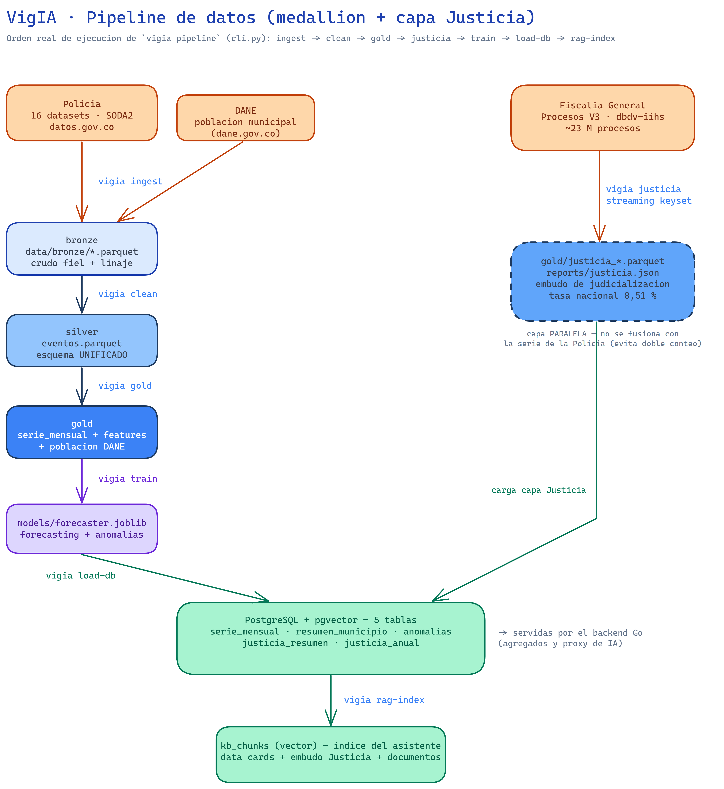

# Arquitectura de VigIA

## 1. Principios de diseño

1. **Separación por responsabilidad** — cada lenguaje en lo que mejor hace: Python para datos/ML/IA,
   Go para una API concurrente y eficiente, React para la experiencia de usuario.
2. **Arquitectura medallion** — los datos fluyen `bronze` (crudo) → `silver` (limpio/unificado) →
   `gold` (agregados y *features* listos para servir/modelar). Cada capa es ejecutable y reproducible.
3. **Reproducibilidad y auditabilidad** — todo el flujo se ejecuta desde una CLI y desde Docker; el
   RAG usa por defecto modelos locales (sin costo de API ni envío de datos a terceros). El **pipeline de
   datos** (bronze→silver→gold) es **determinista bit-a-bit** (semilla fija) y sus métricas se regeneran en
   `reports/`. El **modelo** es reproducible *salvo ruido numérico ~1 %* entre ejecuciones (el gradient boosting
   con `early_stopping` corta según un score sensible a las reducciones de punto flotante multi-hilo, pese a
   las semillas; las conclusiones cualitativas son estables — ver
   [CRISP-ML(Q) - Reproducibilidad](CRISP-ML-Q.md#3-ingeniería-del-modelo)). La generación de texto del
   asistente, al depender de un LLM, tampoco es bit-a-bit reproducible.
4. **Portabilidad** — `docker-compose` levanta el sistema completo en cualquier ambiente; la
   configuración vive en variables de entorno (`.env`).
5. **Escalabilidad** — los componentes están desacoplados por contratos REST; el almacenamiento
   (PostgreSQL + pgvector) alberga tanto los agregados como el índice semántico del RAG.

## 2. Vista de componentes


> Fuente editable: [`diagrams/arquitectura.excalidraw`](diagrams/arquitectura.excalidraw) (Excalidraw).

| Servicio | Tecnología | Responsabilidad | Puerto |
|---|---|---|---|
| `db` | PostgreSQL 16 + `pgvector` | Datos gold + embeddings del RAG + tabla `users` | 5432 |
| `redis` | Redis 7 | Sesiones de auth (refresh tokens, denylist) y rate-limiting | 6379 |
| `ollama` | Ollama | LLM y embeddings locales (proveedor por defecto) | 11434 |
| `ml` | Python 3.11 · FastAPI | ETL, entrenamiento, inferencia de modelos y RAG | 8000 |
| `backend` | Go 1.22 · chi · pgx | API REST / BFF (Backend For Frontend), agregados, proxy al servicio ML | 8080 |
| `frontend` | React 18 · TypeScript · Vite | Tablero, mapas, asistente conversacional | 5173 |

## 3. Flujo de datos (pipeline)

El orden de ejecución es el de `pipeline()` en `cli.py`
(`ingest → clean → gold → justicia → train → validate-anomalies → load-db → rag-index`):



> Fuente editable: [`diagrams/pipeline-datos.excalidraw`](diagrams/pipeline-datos.excalidraw) (Excalidraw).

<details>
<summary>Ver el flujo como texto</summary>

```
Fuentes abiertas:  Policía · 18 datasets SODA2 (16 de eventos + 2 administrativos, datos.gov.co)
                   DANE · DIVIPOLA (SODA2) + población (dane.gov.co, fuera del conteo)
                   Fiscalía · Procesos V3 (dbdv-iihs) — capa paralela de Justicia
                   (= 20 conjuntos de datos.gov.co en total)
   │  vigia ingest          (descarga paginada con reintentos; Justicia por streaming keyset)
   ▼
data/bronze/*.parquet        ← copia fiel del crudo + metadatos de linaje
   │  vigia clean            (fechas ISO/dd/mm/yyyy, normalización DANE, tipado; conserva las
   │                          filas repetidas: el grano es el del publicador — ver docs/CRISP-ML-Q.md §2)
   ▼
data/silver/eventos.parquet  ← esquema UNIFICADO de eventos delictivos
   │  vigia gold             (serie mensual municipio×delito + features + población DANE)
   ▼
data/gold/*.parquet          (serie_mensual · resumen_municipio · resumen_categoria)
   │  vigia justicia         (capa PARALELA Fiscalía → gold/justicia_*.parquet + reports/justicia.json)
   ▼
data/gold/justicia_*.parquet
   │  vigia train            (forecasting + anomalías → models/)
   ▼
models/forecaster.joblib
   │  vigia validate-anomalies (valida las anomalías reales: recall contra eventos documentados
   │                          + corroboración multi-delito → reports/anomaly_validation.json)
   ▼
reports/anomaly_validation.json
   │  vigia load-db          (gold de delito + Justicia + anomalías → PostgreSQL: 5 tablas)
   ▼
PostgreSQL (tablas que expone Go)
   │  vigia rag-index        (data cards + embudo Justicia + documentos → embeddings → pgvector)
   ▼
PostgreSQL (tabla kb_chunks con columna vector)
```

</details>

### 3.1 Unificación de esquemas (reto técnico central)

Las fuentes tienen **dos familias de esquema** y **formatos de fecha distintos**. La capa *silver*
los normaliza a un único modelo de evento:

| Campo unificado | Origen familia A (homicidios, hurtos) | Origen familia B (violencia, amenazas) |
|---|---|---|
| `fecha` | `fecha_hecho` ISO `2003-01-01T00:00:00` | `fecha_hecho` `dd/mm/yyyy` |
| `cod_municipio` (DANE 5) | `cod_muni` (5 díg.) | `codigo_dane` (8 díg. → primeros 5) |
| `departamento`, `municipio` | directo (normalizado a may/sin sufijos) | directo |
| `categoria` | `tipo_delito` / dataset | dataset |
| `arma_medio` | `arma_medio` | `armas_medios` |
| `sexo` | `sexo` | `genero` |
| `cantidad` | `cantidad` (int) | `cantidad` (int) |
| `fuente` | id del dataset | id del dataset |

## 4. Componente de IA

### 4.1 Pronóstico por municipio y mes (`ml/vigia/ml/forecasting.py`)
- **Objetivo:** predecir la cantidad mensual de eventos por municipio y categoría.
- **Enfoque:** un modelo global (`HistGradientBoostingRegressor`) entrenado sobre todas las series con
  *features* de rezago (lags 1, 2, 3, 6, 12), medias/desviaciones móviles, estacionalidad (mes,
  trimestre, seno/coseno, tendencia) e **identidad de serie** (media histórica con ventana de 60 meses y meses
  activos, que dan al modelo el nivel base de cada municipio×categoría sin fuga de datos).
- **Incertidumbre:** cada pronóstico incluye una **banda (~80 %)** derivada de la dispersión robusta de
  los residuos de la validación retrospectiva (*backtest*), ensanchada con √horizonte (error recursivo
  acumulado) y con la **escala calibrada empíricamente sobre esos mismos residuos** (`pi_scale`; cobertura
  80 % por construcción — detalle y acotación en [CRISP-ML(Q) §4](CRISP-ML-Q.md#4-evaluación-del-modelo)).
- **Validación:** *backtesting* temporal **walk-forward** (origen rodante de varios meses, sin fuga de
  datos) con MAE / MASE / sMAPE contra **dos líneas base ingenuas** (persistencia y estacional); el modelo
  final se reentrena con todo el histórico.
  Las métricas se persisten en `reports/model_report.json` (`ml/vigia/ml/evaluate.py`).

### 4.2 Detección de anomalías (`ml/vigia/ml/anomaly.py`)
- **Objetivo:** marcar meses-municipio con incidencia atípica (alerta temprana).
- **Enfoque:** z-score robusto (MAD, *Median Absolute Deviation*) sobre el residuo estacional **por serie** + `IsolationForest` sobre
  features **normalizadas por serie** (z del residuo y z del nivel), de modo que la atipicidad sea
  *relativa* a cada territorio y no la acaparen los municipios de mayor volumen. Una anomalía se reporta
  cuando ambas señales coinciden (consenso).

### 4.3 Asistente ciudadano (RAG + modelo de pronóstico; agente opcional) (`ml/vigia/rag/`)

> **Sobre el término "híbrido".** Aquí "híbrido" significa **combinar la recuperación textual con el modelo
> de pronóstico** (RAG↔modelo, ver abajo), **no** una búsqueda híbrida densa+dispersa (BM25+vector): la
> recuperación es **puramente densa** (embeddings → `pgvector`, similitud coseno).

- **Base de conocimiento:** *data cards* generadas automáticamente desde la capa gold (resúmenes por
  municipio/delito/tendencia, rankings) + contexto administrativo (auditorías/demandas) + glosario +
  embudo de Justicia (Fiscalía) + **documentos no estructurados** (PDF/Word de política pública, vía
  `rag/documents.py`).
- **Documentos (datos no estructurados):** los archivos colocados en `data/kb_docs/` se procesan
  (`pypdf`/`python-docx`), se parten en fragmentos solapados y se indexan junto a las data cards, citando
  **por página**. Así la solución combina datos **estructurados** (series de gold) y **no estructurados**
  (marco normativo) en una sola base de conocimiento.
- **Recuperación:** embeddings multilingües → `pgvector` (búsqueda por similitud coseno).
- **Generación:** LLM vía una **abstracción de proveedor** (`providers.py`) que soporta
  **Ollama (local, por defecto)**, **Claude/Anthropic** y **OpenAI**, seleccionable por configuración (`.env`).
- **Agente con herramientas (`rag/agent.py`, opcional):** con un proveedor que soporte *tool-use*
  (**Anthropic/OpenAI**), el LLM **elige y encadena herramientas** (pronóstico, anomalías, embudo de
  Justicia, serie histórica, base de conocimiento) y cita cada cifra. Es un **agente de un solo actor** (no
  multiagente). **Con Ollama local —el camino por defecto— cae con elegancia al RAG clásico**, sin
  encadenado de herramientas.
- **Híbrido RAG↔modelo:** ante una pregunta de pronóstico sobre un municipio reconocible, el asistente
  invoca el modelo predictivo (`rag/hybrid.py`) e inyecta su salida como contexto citable.
- **Anti-alucinación:** el prompt restringe la respuesta al contexto y cita la fuente; además, si la
  mejor similitud recuperada no supera un umbral, el asistente responde que no tiene datos en vez de
  improvisar.

## 5. Contratos de API (resumen)

### Servicio ML (FastAPI, `:8000`)
| Método | Ruta | Descripción |
|---|---|---|
| GET | `/health` | Estado del servicio |
| POST | `/predict` | Pronóstico por municipio/categoría/horizonte |
| POST | `/simulate` | Simulación de escenarios "¿y si…?" (palancas de intervención/población) |
| GET | `/monitoring` | Salud del modelo (frescura, deriva PSI, backtest a 12 meses) |
| GET | `/anomalies` | Anomalías recientes detectadas |
| POST | `/rag/chat` | Consulta al asistente ciudadano (RAG clásico o agente con herramientas) |
| GET | `/brief/{cod}` | Informe ejecutivo municipal (IA generativa anclada) |

### API Go (`:8080`)
| Método | Ruta | Acceso | Descripción |
|---|---|---|---|
| GET | `/api/v1/health` | público | Liveness (200 si el proceso responde; `db` refleja la conectividad real) |
| GET | `/api/v1/ready` | público | Readiness (503 si la BD es inalcanzable); la usa el healthcheck del contenedor |
| GET | `/api/v1/config` | público | Flags de runtime para el frontend (p. ej. `registration_enabled`) |
| POST | `/api/v1/auth/register` | público (rate-limit) | Crea una cuenta ciudadana (rol `citizen`) y la deja autenticada |
| POST | `/api/v1/auth/login` | público (rate-limit) | Devuelve access + refresh token |
| POST | `/api/v1/auth/refresh` | público (rate-limit) | Rota el par de tokens |
| POST | `/api/v1/auth/logout` | JWT | Revoca access (denylist) y refresh |
| GET | `/api/v1/auth/me` | JWT | Identidad del usuario autenticado |
| GET | `/api/v1/crimes/summary` | público (rate-limit) | Agregados por territorio/periodo |
| GET | `/api/v1/crimes/stats` | público (rate-limit) | Totales reales (COUNT/SUM) para los KPIs del tablero |
| GET | `/api/v1/crimes/municipios` | público (rate-limit) | Ranking/agregado por municipio |
| GET | `/api/v1/crimes/departamentos` | público (rate-limit) | Agregado por departamento (mapa coroplético) |
| GET | `/api/v1/crimes/categories` | público (rate-limit) | Agregado por categoría de delito |
| GET | `/api/v1/crimes/municipio` | público (rate-limit) | Desglose por categoría de un municipio |
| GET | `/api/v1/crimes/timeseries` | público (rate-limit) | Serie temporal por municipio/categoría |
| GET | `/api/v1/anomalies` | público (rate-limit) | Anomalías detectadas |
| GET | `/api/v1/monitoring` | público (rate-limit) | Salud del modelo (proxy al JSON de `vigia health`) |
| GET | `/api/v1/realtime/departamento` | público (rate-limit) | Señal de prensa **reciente** (newsdata.io si hay key, si no GDELT) por departamento (o nacional); se aplica caché en Redis |
| GET | `/api/v1/justicia/resumen` | público (rate-limit) | Embudo nacional de judicialización + KPIs |
| GET | `/api/v1/justicia/municipios` | público (rate-limit) | Tasa de judicialización por municipio |
| GET | `/api/v1/justicia/departamentos` | público (rate-limit) | Tasa de judicialización por departamento |
| GET | `/api/v1/justicia/municipio` | público (rate-limit) | Desglose año×etapa de un municipio |
| GET | `/api/v1/forecast` | **JWT** | Pronóstico (proxy al servicio ML) |
| GET | `/api/v1/simulate` | **JWT** | Simulación de escenarios (palancas en query; proxy al servicio ML) |
| POST | `/api/v1/assistant` | **JWT** | Asistente RAG/agente (proxy al servicio ML) |
| GET | `/api/v1/brief` | **JWT** | Informe ejecutivo municipal (proxy al servicio ML) |

## 6. Decisiones de arquitectura (ADR resumidos)
 
*ADR (Architecture Decision Record o Registro de Decisión Arquitectónica)*

- **ADR-01 — PostgreSQL + pgvector en una sola base.** Evita operar un *vector store* aparte;
  simplifica el despliegue y mantiene los agregados y el índice semántico juntos.
- **ADR-02 — Go como BFF.** El frontend habla con un único backend; Go agrega/cachea y delega la IA
  al servicio Python, manteniendo el modelo de datos pesado fuera del navegador.
- **ADR-03 — LLM local por defecto.** Maximiza reproducibilidad y elimina costos/dependencia de
  terceros para la evaluación; la abstracción permite escalar a modelos gestionados en producción.
- **ADR-04 — Parquet en la capa de archivos.** Columnar, comprimido y tipado; ideal para el volumen
  histórico y para cargas analíticas previas a la base relacional.
- **ADR-05 — Autenticación JWT + Redis (modelo híbrido).** La lectura de datos abiertos permanece
  pública (con *rate-limiting* por IP) para preservar el valor de transparencia; los endpoints de IA
  caros (`/forecast`, `/simulate`, `/assistant`, `/brief`) exigen un **access token JWT** (HS256, corto) enviado como
  `Authorization: Bearer`. Los **refresh tokens** son opacos y viven en **Redis** con rotación de un
  solo uso; el logout revoca el access vía *denylist* por `jti`. Se elige Bearer + refresh (en vez de
  cookies httpOnly) por simplicidad de integración con la SPA y el CORS existente; el coste es exponer
  el token a XSS, mitigado por la vida corta del access y las cabeceras de seguridad. Usuarios y hashes
  bcrypt en la tabla `users` (esquema creado por el backend al arrancar, como el resto del esquema).
  Contraseñas sujetas a política de fortaleza (`auth.ValidatePassword`): una contraseña de admin débil
  aborta el arranque cuando `APP_ENV=production`.
- **ADR-06 — Redis también como caché de respuestas de IA.** Los endpoints de IA (`/forecast`, `/simulate`,
  `/assistant`, `/brief`) son caros (el LLM local en CPU tarda ~30–90 s). El backend cachea sus respuestas `200` en Redis: el pronóstico por
  `(municipio, categoría, horizonte)` (TTL `CACHE_FORECAST_TTL`, def. 6 h, pues solo cambia al reentrenar)
  y el asistente por hash SHA-256 de la pregunta normalizada (TTL `CACHE_ASSISTANT_TTL`, def. 1 h). Responde
  las consultas repetidas en milisegundos y mitiga el cuello de botella de concurrencia. La caché es
  *fail-open* (si Redis cae, se reenvía como siempre) y se puede saltar con `?nocache=1` — un privilegio
  del **rol admin** (para las cuentas ciudadanas el parámetro se ignora: un bypass abierto permitiría
  forzar cómputo caro en bucle, una denegación de servicio barata). Las respuestas se
  devuelven con cabecera `X-Cache: HIT|MISS`.
- **ADR-07 — Aceleración CPU/GPU como override de infraestructura.** El RAG corre
  por defecto en **CPU** (portable a cualquier host; ~30–90 s por respuesta y hasta ~2 min en frío
  en equipos de gama baja —el cuello de botella es la **decodificación del LLM**, medida en ~6 tok/s en un
  portátil con pocos recursos). La aceleración por **GPU NVIDIA** no requiere tocar la aplicación: la imagen
  `ollama/ollama` detecta CUDA al arrancar y descarga las capas al dispositivo, y `vigia.rag` es agnóstico al
  hardware (solo habla HTTP con Ollama). El único requisito es **pasar la GPU al contenedor**, que es
  configuración de Compose, no de código. *Decisión:* mantener la reserva de GPU en un **override separado**
  (`docker-compose.gpu.yml`, atajo `make deploy-gpu`) en vez de en el compose base, porque una reserva
  `driver: nvidia` en el base **aborta el arranque en hosts sin GPU** (`could not select device driver "nvidia"`).
  Así el despliegue por CPU es la opción por defecto que funciona en todas partes y la GPU es opcional, ambos sobre el mismo binario y el mismo `.env`. *Camino complementario para latencia sin GPU:* cambiar
  `LLM_PROVIDER` a un proveedor gestionado (Anthropic/OpenAI) por `.env` —misma abstracción (ADR-03,
  `rag/providers.py`).
