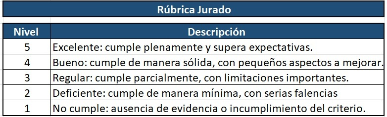
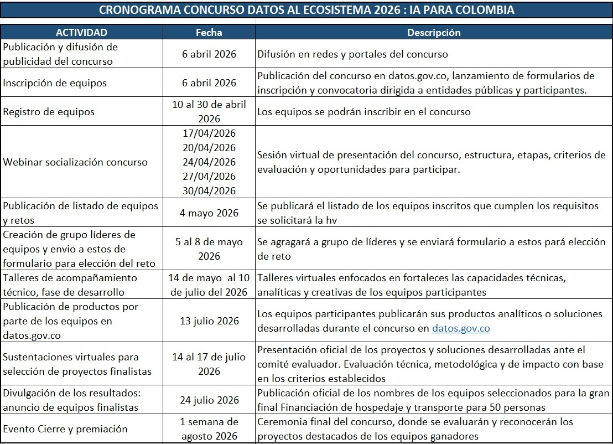

# TÉRMINOS DE REFERENCIA DEL CONCURSO DATOS AL ECOSISTEMA 2026

🧠 El Concurso Datos al Ecosistema 2026: IA para Colombia es una iniciativa nacional orientada a transformar los retos y problemáticas públicas del país en soluciones concretas, mediante el uso estratégico de los datos abiertos disponibles en [datos.gov.co](https://www.datos.gov.co) y el aprovechamiento de herramientas de inteligencia artificial.

Esta convocatoria busca movilizar a la academia, la sociedad civil, emprendedores, desarrolladores, así como a entidades del sector público y privado, promoviendo la conformación de equipos multidisciplinarios que trabajen de manera colaborativa en la identificación y resolución de problemáticas nacionales, sectoriales, regionales y/o institucionales. A través del uso de información pública en formatos abiertos accesibles, reutilizables, de calidad y sin restricciones, se espera potenciar el análisis de datos, la generación de conocimiento y la toma de decisiones basada en evidencia.

🧩 En este contexto, los participantes podrán desarrollar aplicaciones digitales, uso y modelos de inteligencia artificial, tableros interactivos, sistemas predictivos y soluciones basadas en aprendizaje automático, orientadas a dar respuesta a desafíos reales del país. Estas soluciones deberán caracterizarse por su aplicabilidad, capacidad de implementación y escalabilidad, de manera que contribuyan efectivamente a mejorar la gestión pública, fortalecer la innovación y generar valor en los territorios.

La convocatoria promueve la participación activa de todas las regiones del país: Bogotá D.C., Caribe, Centro Oriental, Centro Sur, Eje Cafetero, Llanos Orientales y Pacífico, con un énfasis especial en aquellas zonas que requieren un mayor fortalecimiento del ecosistema digital, como la Amazonía, la Orinoquía y el Archipiélago de San Andrés, Providencia y Santa Catalina. De esta forma, se busca cerrar brechas en el acceso y uso de los datos, incentivando el desarrollo de capacidades locales y la apropiación tecnológica en todo el territorio nacional.

👉 Más allá de la generación de soluciones puntuales, el concurso se consolida como un instrumento para fortalecer la política de datos abiertos en Colombia, articulándose con las Hojas de Ruta de Datos Abiertos Estratégicos Sectoriales y con la Hoja de Ruta Nacional de Datos Abiertos Estratégicos 2025-2026. En este sentido, no solo se promueve el uso de datos abiertos, sino también la construcción de capacidades institucionales y ciudadanas que permitan su aprovechamiento sostenible en el tiempo.

A lo largo del proceso, los equipos participantes identificarán un reto, desarrollarán una solución basada en datos, validarán su aplicabilidad y presentarán su propuesta, en un esquema estructurado que facilita la transformación de ideas en soluciones con impacto real. Este enfoque permite no solo evaluar resultados finales, sino también fortalecer habilidades en análisis de datos, pensamiento crítico, innovación y trabajo colaborativo.

# REGLAS DE PARTICIPACIÓN

El Concurso Datos al Ecosistema 2026: IA para Colombia está dirigido a todas aquellas personas y organizaciones interesadas en transformar los datos abiertos en soluciones con impacto real, convocando a estudiantes de pregrado y posgrado, investigadores, docentes, emprendedores, desarrolladores, funcionarios públicos, organizaciones de la sociedad civil y actores del sector privado. La participación se realizará mediante la conformación de equipos de entre dos (2) y cuatro (4) integrantes, promoviendo el trabajo colaborativo y la integración de capacidades diversas; como requisito, cada equipo deberá contar con al menos una mujer, en línea con el compromiso del concurso con la equidad y el fortalecimiento de la participación en el ecosistema digital.

Se espera que los equipos tengan un carácter multidisciplinario, integrando perfiles asociados al análisis o ciencia de datos (obligatorio al menos uno), así como capacidades en programación, desarrollo de software, tratamiento y transformación de datos, visualización de información y comunicación de resultados. Cada equipo deberá designar un líder, quien será el punto de contacto oficial con la organización y responsable de la inscripción, la entrega de productos y la comunicación durante todas las fases del concurso.

Los participantes deberán trabajar con datos abiertos, priorizando aquellos disponibles en datos.gov.co, así como los conjuntos definidos en las Hojas de Ruta de Datos Abiertos Estratégicos Sectoriales y en la Hoja de Ruta Nacional de Datos Abiertos Estratégicos 2025-2026. El uso efectivo, responsable y creativo de estos datos será un eje central en la construcción y evaluación de las soluciones.

Adicionalmente, cada propuesta deberá incorporar al menos un componente de inteligencia artificial, como ejemplo pueden ser modelos de predicción, clasificación o generación de insights orientado a potenciar el análisis de la información y la generación de valor.

Las soluciones desarrolladas deberán materializarse en productos funcionales tales como aplicaciones web, modelos de inteligencia artificial, dashboards interactivos o sistemas analíticos, los cuales deberán ser aplicables, implementables y escalables. Asimismo, será obligatorio documentar de manera clara y estructurada el proceso de desarrollo, incluyendo la metodología utilizada, preferiblemente bajo lineamientos de CRISP-ML , la arquitectura de la solución, el análisis de datos, los flujos de trabajo y el impacto esperado en términos sociales, económicos o ambientales.

Como parte de los principios de transparencia y reproducibilidad, los equipos deberán publicar sus desarrollos en repositorios abiertos (como GitHub o GitLab), garantizando el acceso al código, la evidencia del uso de datos abiertos y la disponibilidad de la documentación necesaria para su validación. Este aspecto no es menor: si una solución no puede ser replicada o auditada, difícilmente podrá ser considerada viable en el contexto de lo público.

**Para participar:**

- Indispensable realizar la inscripción dentro de los plazos definidos en el cronograma oficial, aceptar los términos y condiciones de la convocatoria y garantizar la originalidad de las propuestas, evitando cualquier tipo de infracción a los derechos de autor.
- Los equipos competirán en categorías diferenciadas según su nivel de experiencia, con el fin de asegurar condiciones equitativas en la evaluación y evitar asimetrías entre perfiles junior y expertos.
- Durante el desarrollo del concurso, los equipos deberán cumplir con la entrega de productos en los tiempos establecidos, participar activamente en las sesiones de formación programadas y asegurar la publicación de sus resultados tanto en repositorios abiertos como en los espacios definidos por la organización, incluyendo la sección de usos de datos del portal [datos.gov.co](https://www.datos.gov.co).
- Los datos, modelos y documentación deberán mantenerse disponibles para efectos de validación por parte del jurado.

En caso de ser seleccionados como finalistas, los equipos deberán participar en la gran final presencial programada para la primera semana de agosto, en representación de su proyecto, salvo situaciones excepcionales debidamente justificadas.

---

# CATEGORIAS 

## 👉 Gobernanza y transparencia 

Proyectos que fortalezcan la rendición de cuentas, la participación ciudadana y el acceso a información pública. Se valorarán iniciativas que: 
- Faciliten el seguimiento de la gestión pública mediante visualizaciones y reportes claros. 
- Promuevan mecanismos de control social y auditoría ciudadana. 
- Desarrollen plataformas que integren datos abiertos para mejorar la confianza en las instituciones. 
- Generen indicadores de transparencia y buenas prácticas gubernamentales. 

## 👉 Sostenibilidad y medio ambiente 

Soluciones orientadas a la protección del entorno y la gestión responsable de los recursos naturales. Se incluyen proyectos que:   
- Monitoreen la calidad del aire, agua y suelos en tiempo real. 
- Apoyen la gestión de riesgos y desastres naturales. 
- Analicen datos sobre biodiversidad y conservación de ecosistemas.
- Propongan estrategias de mitigación y adaptación frente al cambio climático. 

## 👉 Innovación social 

Aplicaciones que mejoren la calidad de vida de la población en áreas clave como salud, educación, movilidad y seguridad. Se valoran iniciativas:
- Herramientas para optimizar la distribución de recursos en programas sociales. 
- Sistemas de alerta temprana en seguridad ciudadana. 
- Plataformas educativas basadas en datos abiertos que reduzcan brechas de aprendizaje. 
- Soluciones de movilidad inteligente que integren información de transporte público y privado. 

# Inteligencia Artificial aplicada a datos abiertos 

Todos los proyectos deben usar IA para enriquecer el análisis y aprovechamiento de los datos públicos. Como sugieridos tenemos:  
- **Analítica predictiva:** predicción de fenómenos sociales, como niveles de pobreza o desempleo. 
- **Detección de anomalías:** identificación de posibles fraudes en subsidios o irregularidades en contratación pública. 
- **IA generativa:** generación automática de reportes públicos, asistentes ciudadanos que respondan consultas usando datos abiertos. 
- **Sistemas de recomendación:** sugerencia de programas sociales o servicios públicos personalizados para los ciudadanos. 
- **Simulación y escenarios:** modelado de crecimiento urbano, planificación territorial o proyecciones de impacto ambiental. 
- **Agentes de IA para servicios públicos:** sistemas que consulten y procesen datos abiertos de manera automática para responder solicitudes ciudadanas. 
- **Procesamiento avanzado de lenguaje natural:** análisis de opiniones ciudadanas, detección de necesidades sociales y comprensión de narrativas públicas.

👉👉 Ejemplo:
Un equipo desarrolla un modelo predictivo utilizando datos de movilidad de datos.gov.co para anticipar congestión y proponer rutas alternativas en tiempo real mediante una aplicación web.

---

# FASES DEL CONCURSO

## Fase 1 – Inscripción y capacitación 
Los equipos podrán inscribirse a través del formulario oficial
Link: [https://forms.cloud.microsoft/Pages/ResponsePage.aspx?id=xnMGGuEkbUe7TbpqkaPFiPI_MT8HoGhJtKuRvzoVE2NUMVM0NEVWQjhCSkQxTUYyM1VDSEVIODU4VS4u](https://forms.cloud.microsoft/Pages/ResponsePage.aspx?id=xnMGGuEkbUe7TbpqkaPFiPI_MT8HoGhJtKuRvzoVE2NUMVM0NEVWQjhCSkQxTUYyM1VDSEVIODU4VS4u)

## Fase 2 - Selección de equipos admitidos y desarrollo 

En esta fase, los equipos inscritos vivirán una experiencia única de formación y descubrimiento. A través de talleres prácticos y capacitaciones especializadas, recibirán las herramientas necesarias para dominar el uso de los datos abiertos y convertirlos en soluciones sólidas e innovadoras. 

Los participantes podrán explorar y aprovechar los datos abiertos estratégicos disponibles en [datos.gov.co](https://www.datos.gov.co), así como en los portales oficiales de entidades del sector público, potenciando su creatividad con metodologías de análisis de datos, ciencia de datos y aplicaciones de inteligencia artificial. Este espacio no solo fortalecerá sus capacidades técnicas, sino que también les permitirá transformar información pública en conocimiento útil y en proyectos con impacto real en el país 

## Fase 3 – Presentación de finalistas

- **Presentación presencial:** Los equipos preseleccionados serán invitados a la ciudad definida para la gran final. para exponer sus proyectos ante un panel de evaluadores expertos. En esta fase se valorará no solo el uso de los datos, sino también la claridad de la propuesta, su impacto potencial, la escalabilidad de la solución y la capacidad del equipo para defender sus ideas frente al jurado. 
- **Reconocimiento como finalista:** Ser finalista del concurso constituye un logro en sí mismo, ya que brinda la oportunidad de mostrar el trabajo en un escenario nacional y de establecer vínculos con actores clave del ecosistema de datos abiertos en Colombia. 

## Fase 4 – Premiación 

La gran final del concurso se celebrará en el marco de los GovCamp 2026, durante la primera semana de agosto. En este espacio se anunciarán los equipos ganadores y se llevará a cabo la ceremonia oficial de premiación. 

Además de los incentivos otorgados, los proyectos más destacados serán difundidos en el portal de [USOS](https://herramientas.datos.gov.co/usos) de datos abiertos del Estado colombiano y en los canales oficiales del Ministerio TIC, con el objetivo de promover su adopción, continuidad y escalabilidad. 

De esta manera, el concurso trasciende la premiación, convirtiéndose en una plataforma para que las soluciones desarrolladas sean conocidas y aprovechadas por entidades públicas, comunidades ciudadanas y empresas privadas, fortaleciendo así el ecosistema de datos abiertos en el país. 

---

# CRITERIOS DE EVALUACIÓN   

- **Innovación y creatividad (15 puntos):** se valorará la originalidad de la propuesta, su carácter disruptivo y la forma en que aporta nuevas perspectivas al uso de datos abiertos. 
- **Uso de datos abiertos (20 puntos):** se calificará la integración y aprovechamiento de datos disponibles en datos.gov.co, priorizando el uso de los definidos en las Hojas de Ruta Sectoriales y Nacional de Datos Abiertos Estratégicos. 
- **Análisis y rigor técnico (15 puntos):** se evaluará la calidad del análisis realizado, la metodología utilizada y la coherencia en la construcción de la solución. 
- **Uso de tecnologías emergentes-IA (20 puntos):** se otorgarán puntos adicionales por la aplicación de inteligencia artificial, machine learning, análisis predictivo u otras tecnologías de frontera. 
- **Impacto y escalabilidad (20 puntos):** se medirá el potencial de la solución para generar beneficios sociales, económicos o ambientales, su posibilidad de réplica y su sostenibilidad en el tiempo. 
- **Diseño, comunicación y usabilidad (10 puntos):** se valorará la forma en que se presenta la solución, la claridad en la comunicación de resultados y la facilidad de uso para ciudadanos o entidades. 

**NOTA:** Para la evaluación de las propuestas, los evaluadores contarán con un instrumento y rúbrica de evaluación. 

**¿Qué se necesita para ganar?**

Los proyectos ganadores serán aquellos que:
- Resuelvan un problema real
- Utilicen datos de manera efectiva
- Integren inteligencia artificial
- Sean aplicables en contextos reales
- Tengan potencial de escalabilidad

**Ejemplo**

Se realizarán una serie de preguntas por cada criterio de evaluación se sumarán los puntos para obtener el nivel y a su vez la calificación por puntos

- **Innovación y creatividad (15 puntos):** Si un jurado califica la propuesta con nivel 4 (Bueno), se asignan 4/5 x 15= 12 puntos. 
- **Uso de datos abiertos (20 puntos):** Si un jurado califica la propuesta con nivel 4 (Bueno), se asignan 4/5 x 20 = 16 puntos. 
- **Análisis y rigor técnico (15 puntos):** Si un jurado califica la propuesta con nivel 4 (Bueno), se asignan 4/5 x 15 = 12 puntos. 
- **Uso de tecnologías emergentes - IA (20 puntos):** Si un jurado califica la propuesta con nivel 4 (Bueno), se asignan 4/5 x 20 = 16 puntos. 
- **Impacto y escalabilidad (20 puntos):** Si un jurado califica la propuesta con nivel 4 (Bueno), se asignan 4/5 x 20 = 16 puntos. 
- **Diseño, comunicación y usabilidad (10 puntos):** Si un jurado califica la propuesta con nivel 4 (Bueno), se asignan 4/5 x 10 = 8 puntos. 

---

# CRONOGRAMA DEL CONCURSO

---

# INCENTIVOS

- Reconocimiento nacional y visibilidad en el portal de datos abiertos. 
- Mentorías con expertos en IA y datos abiertos. 
- Publicación de los proyectos ganadores como casos de éxito en datos.gov.co. 
- Posibilidad de incubación en programas de innovación pública. 
- Licencias 
- Premiación por categorías total de 26 de premios (tablets) 

Los proyectos destacados podrán ser adoptados y escalados.

Los retos del concurso se nutren directamente de los datos disponibles en el **Portal de Datos Abiertos del Estado Colombiano** y de las **Hojas de Ruta de Datos Abiertos Estratégicos Sectoriales**, así como de la **Hoja de Ruta Nacional de Datos Abiertos Estratégicos 2025 - 2026**, accesibles en: 
- [www.datos.gov.co](https://www.datos.gov.co/) 
- [25 Hojas de Ruta de Datos Abiertos Estratégicos Sectoriales](https://www.datos.gov.co/stories/s/25-Hojas-de-Ruta-Sectoriales-de-Datos-Abiertos-Est/6duu-4tms/)
- [Hoja de Ruta Nacional de Datos Abiertos Estratégicos 2025-2026](https://www.datos.gov.co/stories/s/1-Hoja-de-Ruta-Nacional-de-Datos-Abiertos-2025/ivxt-5jyc/)

Estas temáticas buscan inspirar a los equipos a diseñar soluciones con impacto territorial, social y económico. Algunas líneas de trabajo recomendadas incluyen: 
- Seguridad ciudadana y justicia 
- Salud y bienestar 
- Transporte y movilidad 
- Agricultura y desarrollo rural 
- Uso del suelo y planificación territorial 
- Innovación y tecnología 
- Cultura y turismo 
- Economía y empleo 
- Desarrollo sostenible y medio ambiente 
- Educación 
- Temática libre

De esta manera, los participantes podrán alinear sus propuestas con las **necesidades reales de las regiones** y con la **estrategia nacional de datos abiertos**, ampliando el alcance e impacto de sus soluciones. 

---

# DESAFIOS

¡Desafíos Clasificados por Complejidad! 
Los retos estarán organizados según su nivel de complejidad en tres categorías: 
- Básico 
- Intermedio 
- Avanzado 

Para el desarrollo de los desafíos, el concurso establecerá tres niveles de complejidad,diferenciados no solo por el volumen de datos utilizados, sino principalmente por el tipo de problema abordado, el enfoque de inteligencia artificial implementado y el grado de sofisticación de la solución.

**NIVEL BASICO:** Se espera que los equipos desarrollen soluciones orientadas a la analítica descriptiva o predictiva simple, utilizando modelos básicos de inteligencia artificial o aprendizaje automático. En este nivel, el enfoque de IA debe centrarse en generar valor a partir de patrones evidentes en los datos, mediante técnicas como regresión lineal o logística, árboles de decisión simples o modelos de clasificación básicos. También se podrán incluir aproximaciones iniciales de procesamiento de lenguaje natural o generación automatizada de reportes a partir de datos estructurados.

Las soluciones en este nivel deben trabajar con un alcance acotado, utilizando entre uno (1) y dos (2) conjuntos de datos, de datos.gov.co por lo menos uno (1) y un número limitado de variables (entre 3 y 10), priorizando la claridad del problema, la calidad del análisis y la interpretabilidad de los resultados. En este nivel, el énfasis no está en la complejidad técnica, sino en la correcta formulación del problema y el uso adecuado de los datos abiertos.

**NIVEL INTERMEDIO:** Se espera un uso más robusto de la inteligencia artificial, abordando problemas que requieran modelos predictivos más elaborados, detección de patrones complejos o integración de múltiples fuentes de información. En este nivel, los equipos deberán implementar técnicas como modelos de machine learning más avanzados (random forest, gradient boosting, clustering, entre otros), así como aplicaciones más estructuradas de procesamiento de lenguaje natural o sistemas de recomendación básicos.

Las soluciones deberán integrar entre tres (3) y diez (10) conjuntos de datos, de datos.gov.co por lo menos uno (1), con un mayor número de variables (entre 10 y 20), incorporando procesos de limpieza, transformación e integración de datos. El enfoque debe evidenciar un mayor nivel de análisis, validación de modelos y capacidad de generar insights accionables para la toma de decisiones.

**NIVEL AVANZADO:** Se espera el desarrollo de soluciones cercanas a la realidad y a su uso a corto plazo, que integren múltiples enfoques de inteligencia artificial y aborden problemáticas complejas con alto impacto potencial. En este nivel, se priorizan aplicaciones como analítica predictiva avanzada, detección de anomalías en contextos reales, modelos de simulación, sistemas de recomendación personalizados, agentes de inteligencia artificial para servicios públicos, así como el uso de IA generativa para la creación de asistentes, reportes automatizados o sistemas conversacionales basados en datos abiertos.

Las soluciones podrán involucrar integración de grandes volúmenes de datos (Big Data), combinando datos abiertos con fuentes en tiempo real, así como datos estructurados y no estructurados. Se espera el uso de técnicas avanzadas como redes neuronales, modelos de lenguaje, arquitecturas híbridas o sistemas multiagente. Adicionalmente, se valorará la capacidad de automatización, escalabilidad y despliegue funcional de la solución, así como su potencial de implementación en contextos reales del sector público.

👉👉En todos los niveles, el uso de **inteligencia artificial es obligatorio**, pero deberá ser coherente con el nivel de complejidad del desafío, evitando implementaciones superficiales o innecesarias. No se evaluará únicamente la presencia de IA, sino su pertinencia, aplicabilidad, interpretabilidad y aporte real a la solución del problema planteado.

---

# PUBLICACIÓN

¡Lleva tu éxito al siguiente nivel! 

- Una vez los productos estén listos para ser compartidos, los equipos deberán publicarlos en un repositorio digital de su elección (GitHub, GitLab, Dropbox, Google Drive o página web). 
- El enlace a los desarrollos deberá registrarse en la sección de usos del portal de datos abiertos: [https://herramientas.datos.gov.co/usos](https://herramientas.datos.gov.co/usos). 
- Este paso garantiza que todas las soluciones sean **verificables, descargables y accesibles** para organizadores, evaluadores y potenciales reutilizadores de datos abiertos en el país. Solo los proyectos que cumplan con estas condiciones avanzarán en el proceso de evaluación, asegurando la **transparencia, la confianza y la equidad** dentro de la competencia. 

---

# PROTOCOLOS DE ÉTICA 

En caso de que algún equipo participante incurra en infracciones relacionadas con la Ley de Derechos de Autor, plagio o incumplimiento de las normas establecidas en el concurso, será descalificado de manera inmediata.  Asimismo, cualquier conducta que comprometa la transparencia, la equidad o los valores fundamentales de la competencia será reportada a las entidades organizadoras y, de ser necesario, a instancias superiores. 

La ética constituirá el sello distintivo de los proyectos seleccionados, garantizando que cada propuesta refleje integridad y respeto por las reglas. 

**Responsabilidades de los Organizadores**

Los organizadores del **Concurso Datos al Ecosistema 2026: IA para Colombia** asumen el compromiso de garantizar una experiencia justa, inclusiva y enriquecedora para todos los participantes. Sus responsabilidades incluyen: 

- Gestionar de manera eficiente y transparente el proceso de inscripción. 
- Proveer recursos educativos y espacios de capacitación accesibles. 
- Asegurar la imparcialidad y objetividad en la evaluación de los proyectos. 
- Brindar acompañamiento técnico y administrativo durante todas las fases del concurso. 
- Coordinar la logística del evento de cierre, garantizando condiciones óptimas para la premiación. 

De esta manera, los organizadores reafirman su compromiso con la **transparencia, la colaboración y el aprendizaje**, promoviendo un entorno que refleje los valores fundamentales de la competencia en cada etapa. 

---

# RETOS

Los retos estan alineados con las Hojas de Ruta de acuerdo a los conjuntos de datos abiertos disponibles en datos.gov.co. Para ello se tienen los siguientes retos sugeridos:  
1. **Salud y Bienestar** 
    - **Reto:** Desarrollar modelos de IA para predecir brotes de enfermedades transmisibles usando datos de salud pública, vacunación y condiciones ambientales. 
    - **Datos sugeridos:** Registros de morbilidad, coberturas de vacunación, calidad del aire y acceso a servicios de salud. 
    - **Impacto:** Mejora en la prevención y respuesta temprana del sistema de salud. 
2. **Seguridad Ciudadana y Justicia** 
    - **Reto:** Crear sistemas de análisis predictivo para identificar patrones de criminalidad y proponer estrategias de prevención. 
    - **Datos sugeridos:** Estadísticas de delitos, denuncias ciudadanas, mapas de movilidad urbana. 
    - **Impacto:** Fortalecimiento de políticas públicas de seguridad y justicia. 
3. **Transporte y Movilidad** 
    - **Reto:** Optimizar rutas de transporte público mediante algoritmos de IA que integren datos de tráfico, tiempos de viaje y demanda ciudadana. 
    - **Datos sugeridos:** Datos de movilidad urbana, sensores de tráfico, encuestas de transporte. 
    - **Impacto:** Reducción de tiempos de desplazamiento y emisiones contaminantes. 
4. **Agricultura y Desarrollo Rural** 
    - **Reto:** Implementar modelos de IA para predecir rendimientos agrícolas y riesgos climáticos. 
    - **Datos sugeridos:** Producción agrícola, uso del suelo, datos meteorológicos y precios de mercado. 
    - **Impacto:** Mayor productividad y resiliencia de comunidades rurales. 
5. **Economía y Empleo** 
    - **Reto:** Construir tableros inteligentes que identifiquen tendencias de empleo y sectores emergentes. 
    - **Datos sugeridos:** Estadísticas laborales, registros de empresas, datos de educación superior. 
    - **Impacto:** Orientación de políticas de empleo y formación profesional. 
6. **Desarrollo Sostenible y Medio Ambiente**
    - **Reto:** Usar IA para monitorear deforestación y contaminación hídrica en tiempo real. 
    - **Datos sugeridos:** Imágenes satelitales, registros ambientales, datos de calidad del agua. 
    - **Impacto:** Protección de ecosistemas estratégicos como la Amazonía y el Pacífico. 
7. **Innovación y Tecnología** 
    - **Reto:** Diseñar asistentes virtuales que faciliten el acceso ciudadano a datos abiertos. 
    - **Datos sugeridos:** Catálogo de datos de datos.gov.co, registros sectoriales. 
    - **Impacto:** Mayor apropiación ciudadana del ecosistema digital. 
8. **Cultura y Turismo** 
    - **Reto:** Crear sistemas de recomendación turística basados en IA que integren datos culturales y de movilidad. 
    - **Datos sugeridos:** Inventarios culturales, estadísticas de visitantes, datos de transporte. 
    - **Impacto:** Impulso al turismo sostenible y regional. 
9. **Educación** 
    - **Reto:** Desarrollar análisis estadísticos y de Machine Learning para comprender la deserción universitaria. 
    - **Datos sugeridos:** Sistemas de información de las universidades, modelos estadísticos realizados, datos de las carreras en la Universidad. 
    - **Impacto:** Implementar Observatorios de Deserción con análisis IA. 

**Consideraciones Clave**

- **Clasificación por complejidad:** Retos básicos (análisis descriptivo), intermedios (modelos predictivos) y avanzados (IA aplicada a Big Data y fuentes en tiempo real). 
- **Transparencia:** Todos los proyectos deben publicarse en repositorios abiertos y reportarse en la sección de usos de datos.gov.co. 
- **Impacto territorial:** Se recomienda priorizar regiones con menor participación digital (Amazonía, Orinoquía, San Andrés y Providencia). 

Este concurso consolida una apuesta país por el uso estratégico de los datos y la inteligencia artificial, dejando capacidades instaladas que permitirán a Colombia seguir desarrollando soluciones innovadoras para sus desafíos.

- Listado de datos abiertos por reto (sugerencias): [Matriz_DatosAlEcosistema2026 - Capacitacion datos abiertos.xlsx](https://mintic-my.sharepoint.com/:x:/g/personal/llara_mintic_gov_co/IQAm6hx5GyqDTLREULpr5AQYAdwA4KDYOGW0oVz9LRX2MEw?e=g2hlqa)

*Tomado de la Página [Concurso Datos al Ecosistema 2026 IA para Colombia](https://www.datos.gov.co/stories/s/Concurso-Datos-al-Ecosistema-2026-IA-para-Colombia/ddau-8cy9)*

